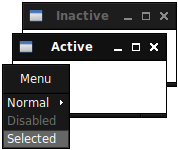

# tenebris

Dark theme for the [openbox](http://openbox.org) window manager. It's based on the `Nightmare` theme, using the `Bear2` pixmaps.

## Installation

You need to build the theme file by running `make`. This will create the `tenebris.obt` file that can be installed from the `ObConf` application or manually editing the configuration files.

